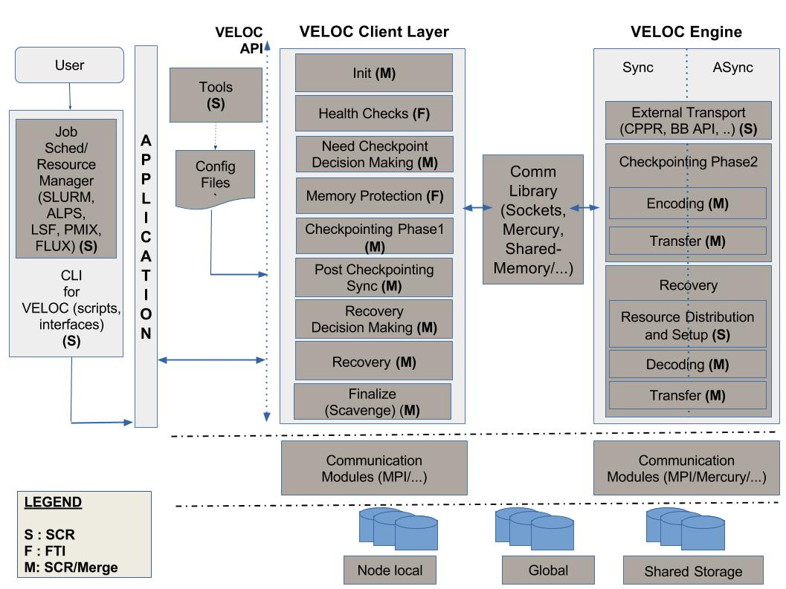

.. raw:: latex

   \vspace*{1.0in}

.. raw:: html

   

--------------

.. raw:: html

   

VELOC Design Document
=====================

.. raw:: html

   

--------------

.. raw:: html

   

.. raw:: latex

   \vspace*{10.0ex}

.. raw:: latex

   \Large

.. raw:: latex

   \vspace*{2.0ex}

Revision 0.5, Authored by the VELOC team

.. raw:: latex

   \normalsize

.. raw:: latex

   \setcounter{page}{0}

.. raw:: latex

   \thispagestyle{empty}

.. raw:: latex

   \newpage

.. raw:: latex

   \tableofcontents

Purpose
-------

This document details the design and description of the VELOC software.
This is an initial draft of the design and is subject to change in the
coming months as the design continues to evolve.

VELOC Project Description
-------------------------

The Mean Time Between Node Failure (MTBNF) of the DOE CORAL systems and
future exascale systems imposes a fault tolerance mechanism to guarantee
that executions complete successfully even in case of node failures.
Currently, the majority of HPC applications use ad hoc
checkpoint/restart for fault tolerance. However, the addition of
nonvolatile memory and burst buffers in systems will require nontrivial
code modifications to handle the diversity of architectures and to
actually realize benefit from these new levels of storage. Dozens of
very complex applications will need significant modifications. Moreover,
without specific optimizations for fast restart from checkpoints stored
on nonvolatile memory, the execution will potentially experience very
long delays in retrieving the checkpoint on the file system.

The VELOC project will address these challenges by providing a framework
offering a checkpoint/restart interface and providing transparently the
benefit of multilevel checkpointing to exascale applications.

VELOC will have three major impacts. It will: (1) optimize
checkpoint/restart performance for applications and workflows; (2)
increase programmer productivity by dramatically reducing the difficulty
of handling varied and complex storage architectures and the need for
performance/reliability optimizations; (3) benefit a wide community.

VELOC project goals include:

#. Providing a single API for data structure oriented and file oriented
   checkpoint/restart
#. Providing an active back-end performing the checkpoint movements
   concurrently and asynchronously to the application execution
#. Optimizing multi-level checkpointing for the available CORAL and ECP
   relevant systems with deep/complex storage hierarchies: local memory,
   NVM, local burst-buffers, remote burst buffers, parallel file systems
#. Integrating VELOC in I/O libraries (HDF5, ADIOS, PnetCDF), advanced
   batch scheduler, Vendor data movement software

VELOC Design Description
------------------------

From a technical perspective, the VELOC framework consists of the VELOC
API specification and the implementation software that use this VELOC
API. The VELOC API can be used by high-level user applications as well
other high-level libraries to perform multi-level checkpointing.

The VELOC software is based on a distributed and modular software
architecture, as shown in
Figure \ `[fig:logical-diagram] <#fig:logical-diagram>`__. The design
consists of two main components: (1) VELOC client layer, (2) VELOC
engine.

Logical Diagram and Description
-------------------------------

For this project we define “level” as the cross-product of the storage
layer and the redundancy scheme.

.. raw:: latex

   \centering

   VELOC Logical Diagram

VELOC Client Layer
~~~~~~~~~~~~~~~~~~

The VELOC Client layer exposes the VELOC API to end-users. The VELOC API
consists of a dozen versatile routines that allow end-users to define
their checkpointing needs, perform checkpointing and transparent
recovery. The VELOC client layer is made of five main modules.

The checkpoint decision module offers an interface that the application
code can call to check if it is recommended to take a checkpoint. The
recommendation is computed from the characteristics of the first level
of the storage hierarchy (failure rate hierarchy, bandwidth).

The Local checkpoint phase is performing the checkpoint to the first
level of checkpointing. It checkpoints the data structures identified by
the programmer (FTI style) and it returns the pass to the checkpoint
file at the first level when the ``VELOC_route_file`` function is called
(SCR style).

The postcheckpointing module is responsible for informing the VELOC
engine that the checkpoint at the first level is completed it also
communicates identification of the checkpoint file to consider. This
information allows the VELOC engine to know when a checkpoint is ready
on the first level of the storage hierarchy and what checkpoint file to
consider.

The checkpoint recovery decision module checks if the current execution
is a normal execution or a restart. If it is a restart, it checks if a
checkpoint is available at the first level of checkpointing. If a
checkpoint is available, it calls the module performing the checkpoint
recovery phase. If no checkpoint is available on the first level, it
delegates the checkpoint recovery to the VELOC Engine. When the VELOC
Engine has recovered a checkpoint, it copies it to the first level of
storage and informs the checkpoint recovery decision module. Upon
notification, the checkpoint recovery module calls the module performing
the checkpoint recovery phase.

The module performing the checkpoint recovery phase takes the checkpoint
file available at the first level and instantiate the data structures
with the checkpoint content (FTI style). If ``VELOC_route_file`` is
called, it returns the pass to the checkpoint file at the first level.

VELOC Engine
~~~~~~~~~~~~

The VELOC Engine primarily focuses on encoding data and storing
checkpoints on non-local storage in an efficient and optimized manner.
It also deals with data recovery, decoding and resource distribution
when dealing with restarts after catastrophic failures.

The VELOC Engine is composed of two main modules: the non-local
checkpoint phase module and the Recovery module.

The non-local checkpoint phase module takes the checkpoint available at
the first level and moves or copy (depending on the replication policy
specified on the configuration file for each level) it to the different
levels. This module is also responsible to move the checkpoint to other
node for the partner copy and to compute encoding schemes (XOR and
Reed-Solomon) and distribute the encoded checkpoints on the
participating nodes. This modules also computes the groups that are used
for partner copy and encoding schemes based on the system topology.

The recovery module of the VELOC Engine is responsible of recovering a
set of consistent checkpoints from which the application execution can
be restarted. The module is executed after an execution failure.
Depending on the type of failures (process, node, switch, power unit),
one or more checkpoints will not be available at the different level of
checkpoints. The recovery module first needs to identify the level of
checkpointing from which it can recover a consistent checkpoint. If the
identified checkpoint level is encoded (XOR or Reed-Solomon), the
recovery module decodes and reconstructs the missing the checkpoints.
The VELOC Engine returns the pass of the available checkpoint to the
VELOC Client. The VELOC Client forwards the pass to the application if
the application calls the ``VELOC_route_file`` function.

VELOC API
---------

The VELOC API is used by the application to interface with the VELOC
Client. The functions of the API are described in the companion VELOC
API document.

Implementation Plan
-------------------

This chapter talks about how the VELOC API functionality is mapped to
the VELOC logical diagram. See
Figure \ `[fig:implementation-diagram] <#fig:implementation-diagram>`__.

.. raw:: latex

   \centering

   VELOC Implementation Diagram

.. _sec:tools:

Tools
~~~~~

The tools functionality in VELOC refers to scripts that are used as part
of VELOC but externally/disjoint from an application run or job. The
tools we expect to use in VELOC are:

-  Checkpoint schema generator script: We need a script that will read
   in the system specification and generate a user checkpoint schema
   configuration file. The system specification file contains details
   about the components of a system, storage devices and their
   performance, failure rates, and components with correlated failure
   modes, e.g. share a power supply. The checkpoint schema file will
   describe the storage locations and encoding schemes to be used.
-  Checkpoint schema validation script: We need a script to read in a
   checkpoint schema file and validate it for basic correctness.
-  Index program: A script for telling the user what checkpoints exist
   for restart and what checkpoint is the most recent one which would be
   used for restart on the parallel file system. Users can change the
   checkpoint to be used for restart using this program.

GAPS
^^^^

The gaps for tools are the checkpoint schema generator and validation
scripts. They do not exist in FTI or SCR.

EXISTING CODE
^^^^^^^^^^^^^

The index script exists in the SCR code base as a binary in
``src/scr_index.c``

Command Line Interface
~~~~~~~~~~~~~~~~~~~~~~

The scripts functionality in VELOC will be used from the command line
and in batch scripts for using VELOC with applications.

-  Run: This script is a wrapper around the “run” command that a user
   would use to launch their parallel job, e.g. mpirun or srun or aprun.
   The script contains logic for checking the health of compute nodes
   and storage, launching any helper daemons (e.g., for asynchronous
   activities, checking for job hangs), launching the job and restarting
   the job if it fails, and copying the last checkpoint from cache down
   to the parallel file system if it does not already exist there.

   -  Prerun: This script is called by the run script and performs the
      activities needed before the application is launched either for
      the first time or at restart.
   -  Postrun: This script is called after all runs of the application
      have completed (after possible restarts) to perform any cleanup
      activities and also scavenge the last checkpoint down to the
      parallel file system if needed.

-  Halt: This program allows users to tell VELOC when to halt their
   program that is currently running under VELOC control.
-  Exclude: This program or script will allow users to tell VELOC which
   nodes to exclude from an allocation for runs. This is necessary in
   some cases, e.g., if the resource manager is not aware that a node is
   down or not functioning properly. VELOC health scripts may detect the
   problem and can use this exclude script to inform other components to
   avoid problematic nodes.

.. _gaps-1:

GAPS
^^^^

Exclude does not exist as a program in either FTI or SCR. The concept
exists in SCR as an environment variable that can be fed into the “run”
scripts of SCR.

.. _existing-code-1:

EXISTING CODE
^^^^^^^^^^^^^

-  Run: Exists in the SCR code base in the scripts directory. There are
   customized scripts for different resource managers since they have
   different interfaces and requirements, e.g., ``scr_srun`` is for
   SLURM, ``scr_aprun`` is for ALPS. SCR has capability of interacting
   with SLURM, ALPS, LSF, PMIx, and Flux resource managers.

   -  Prerun: Exists in the SCR code base in the scripts directory
   -  Postrun: Exists in the SCR code base in the scripts directory

-  Halt: Exists in SCR code base in src/scr_halt.c.

Client Layer
~~~~~~~~~~~~

Initialization
''''''''''''''

API
^^^

``VELOC_Init()``

DESCRIPTION
^^^^^^^^^^^

Initializes the library. This function is collective across all
processes in the application (``MPI_COMM_WORLD`` in MPI). Optionally
pass the path to a user configuration file, must have same value on all
processes. Can pass NULL if no configuration file is specified or if one
is given another way.

IMPLEMENTATION
^^^^^^^^^^^^^^

See ``SCR_Init`` and ``FTI_Init``. Its primary function is to:

#. Read configuration files (``scr_get_params``, ``scr_param_init``,
   ``FTI_LoadConf``). This read should be efficient in a parallel code,
   such that only one process reads the file and broadcasts the settings
   to other processes (``scr_config_mpi.c``).
#. Distribute and rebuild datasets in cache (scr_cache_rebuild,
   FTI_RecoverFiles).

   #. If MPI ranks are running on different nodes than the previous job,
      it may be necessary to first transfer files from original nodes to
      new nodes (``scr_distribute_datasets``,
      ``scr_distribute_reddescs``, ``scr_distribute_files``).
   #. After transfer, files may be rebuilt if needed and if possible,
      otherwise all files for the checkpoint should be deleted
      (``scr_reddesc_recover``).

#. Prefetch checkpoint from the parallel file system
   (``scr_fetch_sync``, ``FTI_RecoverL4``).

   #. If no checkpoint can be rebuilt, then a checkpoint should be
      fetched from the file system if one is available
   #. We fetch the most recent checkpoint (or the checkpoint marked as
      current). If that fetch fails, we fall back to try older
      checkpoints.

#. Initialize other components

.. _gaps-2:

GAPS
^^^^

None currently – will need to initialize new components as they are
integrated.

Finalize
''''''''

.. _api-1:

API
^^^

``VELOC_Finalize()``

.. _description-1:

Description
^^^^^^^^^^^

Shut down the library. Flush any datasets to the parallel file system,
or otherwise initiate vendor API to post-stage data (``scr_flush_sync``,
``FTI_Flush``). Clean up cache (``FTI_Clean``). Finalize components.
This function is collective across all processes in the application
(``MPI_COMM_WORLD`` in MPI).

.. _implementation-1:

Implementation
^^^^^^^^^^^^^^

See ``SCR_Finalize`` and ``FTI_Finalize``.

.. _gaps-3:

Gaps
^^^^

None currently – will need to shut down new components as they are
integrated.

Need Checkpoint
'''''''''''''''

.. _api-2:

API
^^^

``VELOC_Need_checkpoint()``

.. _description-2:

Description
^^^^^^^^^^^

Informs the application as to whether it should checkpoint, which may be
determined by the optimal checkpoint interval based on checkpoint speed
and failure frequency of the given system or due to nearing the end of
an application allocation. This function is collective across all
processes in the application (``MPI_COMM_WORLD`` in MPI).

.. _implementation-2:

Implementation
^^^^^^^^^^^^^^

See ``SCR_Need_checkpoint`` and ``FTI_Snapshot``.

.. _gaps-4:

Gaps
^^^^

Add support for computing optimal checkpointing time in prototype.
Integrate with external agents to determine best checkpoint interval.

Health Checks
'''''''''''''

The health checks module is mainly for checking the status of the
environment (such as storage availability, accessibility of the
directories, and aliveness of the backend process). Included here are
some potential, internal API functions.

Check Configuration
^^^^^^^^^^^^^^^^^^^

::

   void VELOC_Check_Configuration(
    OUT int * status
   )

**Description**: Check if the configuration setting is valid. The value
of status:

-  ``VALID`` (0)
-  ``INCORRECT_COMB_ENC_AND_STORAGE`` (1)
-  ``INCORRECT_RS_GROUP_SIZE`` (1)
-  other?

**Note**: as for ``INCORRECT_COMB_ENC_AND_STORAGE``: for example, the
users are not allowed to combine Partner copy encoding and PFS.

Check Storage
^^^^^^^^^^^^^

::

   void VELOC_Check_Storage_Availability(
    IN  char * directory,
    OUT int * status
   )

**Description**: Check if the specified directory has the “write”
permission and enough space. The directory could be any possible storage
path, such as local storage, parallel file system. The value of status:

-  ``SUCCESS`` (0)
-  ``NO_SUCH_DIRECTORY`` (1)
-  ``NO_WRITE_PERMISSION`` (2)
-  ``NO_ENOUGH_SPACE`` (3)
-  other?

Check Backend Availability
^^^^^^^^^^^^^^^^^^^^^^^^^^

::

   void VELOC_Check_Backend_Aliveness(
    OUT int *status
   )

**Description**: Check if the dedicated backend process is launched
successfully or still alive. The value of status:

-  ``SUCCESS`` (0)
-  ``DEAD_CHECKPOINT_LISTENER`` (1)
-  ``DEAD_RESTART_LISTENER`` (2)
-  others

**Implementation**: Let the front-end rank 0 send a checking message to
the back-end process.

Check Nodes
^^^^^^^^^^^

::

   void VELOC_Check_Backup_Nodes(
    OUT int * status
   )

**Description**: Check if the backup nodes are alive. The value of
status:

-  ``ALL_ALIVE`` (0)
-  the number of dead/unavailable backup nodes (1...n)
-  other?

**Implementation**: Let the rank 0 ping all backup nodes.

Memory Protection
'''''''''''''''''

VELOC Memory Protection module is responsible for specifying the
variables to protect. This supports the FTI-style memory protection
interface. The key functions include 2 internal-API functions and 4
private functions.

Memory Type
^^^^^^^^^^^

::

   void VELOC_Mem_type(
    IN  size_t size
    OUT VELOC_type *type
   )

**Description**: This function initializes a new data type to be used
with memory registration calls. The caller must specify the size of the
data type in bytes. The function is local to each process. Each process
may define its own datatypes.

**Implementation**: Set id and the size of the type variable, and
increase the id (i.e., nbType) by 1.

Memory Protect
^^^^^^^^^^^^^^

::

   VELOC_Mem_protect(
    IN int id
    IN void * ptr
    IN long count
    IN VELOC_type type
   )

**Description**: This function registers a memory region for
checkpoint/restart. VELOC internally associates the caller’s label id
with the memory region as defined by the pointer to the start of the
region, the number of elements, and the type of the elements in the
region. The memory region will be persisted during a checkpoint and
recovered upon restart.

**Implementation**: The idea is to maintain all variables to protect in
a vector (declared as static ``VELOC_dataset``
``VELOC_Data[VELOC_BUFS];``). First, select the corresponding item in
the vector ``VELOC_Data`` if it exists, and update it by the new pointer
ptr, count and type. If it does not exist, create a new item and append
it to the end of the ``VELOC_Data`` vector.

Checkpointing Phase
'''''''''''''''''''

The checkpointing phase of the application layer is responsible merely
for writing the applications files to the fastest available storage
level considering the configuration files used, with no redundancy
applied. The application registers a file with VELOC by calling the
``VELOC_Route_file()`` method. This method takes a path to the PFS and
returns a path to the fastest storage level available. The application
then writes to the new path as it would otherwise to the PFS.
Applications that checkpoint using ``VELOC_Protect()`` automatically
generate the ``VELOC_Route_file()`` and POSIX calls necessary to execute
this phase. Code for this phase exists in ``SCR_Route_file()`` and in
``FTI_Checkpoint()``, and this functionality will be merged for VELOC.
This phase will also include the ``VELOC_Start_checkpoint()`` function.

Post Checkpointing
''''''''''''''''''

The post-checkpointing phase of the client layer records the successful
completion of the checkpointing phase and calls the VELOC engine to
apply redundancy and transfer the data to other storage media as
necessary. The application informs the post-checkpointing phase whether
the data was written properly, and if so the post-checkpointing phase
passes all metadata necessary for the VELOC engine to the backend. Code
for this phase exists in both SCR and FTI, but will need to be rewritten
on the basis of the new communication interface that will be written for
communication between the client layer and the VELOC engine. This will
be managed by the ``VELOC_Complete_checkpoint()`` function.

Recovery Decision Making
''''''''''''''''''''''''

The recovery decision making phase of the client layer helps
applications determine where their checkpoint files exist to recover
from the most recent checkpoint. The ``VELOC_Status()`` function returns
information on whether VELOC has a checkpoint in cache, or failing that
whether it has one on the PFS. This functionality already exists in
``FTI_Status()``, and in SCR can be gleaned from ``SCR_Route_file()``.
These will be merged into a single function and divorce from the file
routing functionality.

Recovery
''''''''

If VELOC has a checkpoint in cache from which to restart., the
application can use ``VELOC_Route_file()`` to get the location of that
file for file-based restart, or can use ``VELOC_Mem_recover()`` to
recover values protected by ``VELOC_Protect()``. This functionality
exists in ``SCR_Route_file()`` and in ``FTI_Recover()``. This phase will
include communication with the VELOC engine to retrieve files from the
redundancy scheme the files were stored under.

Client Layer Communication
''''''''''''''''''''''''''

VELOC1.0 will be a MPI-based code. VELOC will include a well-factored
communication layer so that later work can replace MPI with another
communication library if so desired. SCR and FTI are both MPI-based
codes, making an initial MPI implementation sensible.

Engine
~~~~~~

External Transport
''''''''''''''''''

VELOC will support multiple vendor-specific asynchronous transfer APIs
for future storage technologies. These technologies will be
interchangeable and abstracted behind a consistent internal API. An
initial implementation of this plugin-style interface is implemented in
SCR. It includes support for the following:

-  IBM BBAPI
-  Intel CPPR
-  Cray Datawarp

Checkpointing Redundancy Mechanism
''''''''''''''''''''''''''''''''''

.. raw:: latex

   \centering

layers.

   +--------------+--------+---------+-----+--------------+
   |              | Single | Partner | XOR | Reed-Solomon |
   +==============+========+=========+=====+==============+
   | RAM Disk     | X      | X       | X   | X            |
   +--------------+--------+---------+-----+--------------+
   | 3D XPoint    | X      | X       | X   | X            |
   +--------------+--------+---------+-----+--------------+
   | SSD          | X      | X       | X   | X            |
   +--------------+--------+---------+-----+--------------+
   | Burst Buffer | X      | X       | X   | X            |
   +--------------+--------+---------+-----+--------------+
   | PFS          | X      |         |     |              |
   +--------------+--------+---------+-----+--------------+

The users are allowed to tailor their own checkpointing approach by
selecting an encoding method and a storage device.

#. Single copy is handled by the client layer.
#. Parter-copy is creating one full copy for each checkpointing file and
   copying it to a partner node in case of the crash of the current
   node.
#. XOR is similar to RAID 5. Compute XOR file from a set of checkpoints
   files. In a failure, it can recover any file in the set using XOR
   file and remaining :math:`N-1` files. If a checkpoint file is
   :math:`B` bytes, the total space required for the checkpoint and
   redundancy data is :math:`B+B/(N-1)` bytes, where :math:`N` is the
   size of the XOR set. Unlike Parter-copy, each checkpointing file
   needs 1 full copy + some fraction in XOR encoding.
#. Reed-Solomon (RS) encoding: When using RS encoding for fault
   tolerance in HPC, the system will be partitioned in groups of
   :math:`K` processes (:math:`K` checkpoint files), thus the groups can
   encode the checkpoint files in parallel. Each group will generate
   :math:`M` encoded checkpoint files in order to tolerate :math:`M`
   erasures. To reach the optimal RS efficiency, VELOC detects the
   processes belonging to the same node and build a sketch of the
   cluster’s topology, such that all the processes in a group belong to
   different nodes, similar to the chipkill technology used in computer
   memories. The highest level of reliability is adopted: generating
   :math:`M=K` encoded checkpoints per group. Since the encoded
   checkpoint files will be stored in the same devices than the
   checkpoint files, one failure will generate two erasures, one
   checkpoint file and one encoded checkpoint file, thus each group can
   tolerate :math:`M/2` process failures. In the configuration, the
   number of nodes per group must be a multiple of 4.

Encoding
^^^^^^^^

The encoding module is responsible for performing the redundancy
encoding action in the VELOC engine. In the init function, there is a
separate process / thread launched / connected to on each node for
listening for the encoding request from the client layer. Upon a
encoding request, it will perform the specific action (such as data
encoding and transferring) in the VELOC engine. It involves four
encoding schemes (including single copy, partner copy, XOR, and
Reed-solomon encoding) and multiple storage levels (such as Ramdisk, 3D
Xpoint, SSD, BurstBuffer, and Parallel File System), as shown in
Table \ `[table:encoding-storage] <#table:encoding-storage>`__.

The basic implementation approach is maintaining complete checkpointing
files or erasures in different directories which are all visible to the
dedicated VELOC engine process. XOR encoding will be implemented based
on the corresponding codes in SCR, and Reed-Solomon Encoding will reuse
some codes in FTI. Specifically, VeloC VELOC engine will also perform
the RS-encoding by calling a third-party library (Jarasure), similar to
FTI.

Decoding
^^^^^^^^

Decoding is the reverse process of the the encoding. It aims to restore
the missing checkpointing files by specific encoding algorithm, such as
XOR and Reed-Solomon encoding. It will be performed upon the recovery
request sent from the client layer.

Validation
^^^^^^^^^^

VELOC must offer the functionality of validating a set of files which
has been encoded. This functionality may be utilized by the engine
during preparation for a restart operation, or by the user through a
provided tool.

Engine Communication
''''''''''''''''''''

The VELOC client layer and engine will have to communicate in some way.
This communication will allow for run-time configuration settings as
well as file coordination variables to be passed between the two.
Currently, both SCR and FTI have a single binary encompassing all of
client and engine functionality. Thus, this communication is currently
achieved via direct function calls and represents a gap that must be
addressed.

Within VELOC, a consistent internal communication API will have to be
defined. This will allow both the client layer and engine to be
developed in parallel, with well-defined interactions between logically
discrete modules. Additionally, this will allow for the possibility of
both a synchronous and asynchronous engine.

The exact form of the communication interface can then be implemented in
a number of technologies. Possible options for implementing this
communication include sockets, Mercury, files, or shared memory. SCR
currently uses a file-based approach in its asynchronous mode.

Client Layer and Engine Communication
~~~~~~~~~~~~~~~~~~~~~~~~~~~~~~~~~~~~~

The backend engine module of VELOC will need to be able to communicate
across the compute nodes in the job. We will design a generic interface
for the VELOC engine software to communicate that could utilize
different communication packages behind it. As a first pass, we envision
using MPI for communication but plan to use the ECP Data Services
project Mercury software too.

.. _existing-code-2:

EXISTING CODE
^^^^^^^^^^^^^

In both SCR and FTI, the engine functionality is implemented as a
library in the user application. Both SCR and FTI are dependent on MPI
for communication.

.. _gaps-5:

GAPS
^^^^

This communication module is a gap in both SCR and VELOC and will need
to be developed for VELOC.

Configuration Files
-------------------

The interactions between the VELOC library and the application will be
configured through 3 files:

#. The system specification file
#. The user constraint file
#. The user’s checkpoint schema file

Currently, both FTI and SCR support a single user configuration file.
This user configuration file is divided into two parts in VELOC: the
system specification and the user’s checkpoint schema. VELOC will
provide a tool to help users create their checkpoint schema file, based
around their particular constraints.

System Specification File
~~~~~~~~~~~~~~~~~~~~~~~~~

The specification file is similar to SCR’s system-level configuration
file. It will be directly parsed by the VELOC library during startup.
This file includes large amount of system-specific information,
including:

-  System failure groups (specified by node)
-  Failure rates of different components
-  Storage hierarchy details
-  Layers and storage technologies which are available
-  Bandwidth / performance details
-  File system configuration settings

User Constraints File
~~~~~~~~~~~~~~~~~~~~~

The user constraints file will be new to VELOC and is not previously
defined by either SCR or FTI. This file will not be parsed directly by
the VELOC library, rather, it will be processed by a newly created tool
(discussed in Section \ `6.1 <#sec:tools>`__). Along with the system
specification file, the user constraints file will be processed by the
tool to create a checkpoint schema file. For our initial project
integrations, the user constraints will be communicated to the VELOC
development team in order to create an application specific checkpoint
schema.

Checkpoint Schema File
~~~~~~~~~~~~~~~~~~~~~~

The checkpoint schema (could also be called “redundancy” or “output”
schema) is analogous to the current FTI and SCR user configuration
files. This file could be generated by future tool (from the system
specifications and user constraints). The checkpoint schema will
encapsulate the various application/project/user specific settings for
VELOC. These settings include:

-  Whether VELOC is functioning in asynchronous or synchronous mode
-  The final resting place for all of a specific user’s files. This
   location could be where an application would directly write
   checkpoint files without VELOC interference. Currently, this setting
   is specified through the FTI ``Glbl_dir`` and SCR ``SCR_PREFIX``
   variables.
-  Debug parameter for the level of detail specified by VELOC output
   messages
-  Application specific run management and restart parameters
-  Parameters for each of the encoding schemes
-  Settings for managing the number of checkpoint files which exist
-  Checkpoint level specification (see Figure below)
-  Interval for when to apply this level (either by iteration or
   seconds)
-  The failure group for this level (for which the redundancy will
   protect against)
-  The storage layer for this level
-  The redundancy type for this level
-  When necessary, each setting will be defined with a reasonable
   default vault.

::

   CKPT=0 INTERVAL=1 GROUP=NODE   STORE=/tmp TYPE=SINGLE
   CKPT=1 INTERVAL=3 GROUP=SWITCH STORE=/tmp TYPE=XOR
   CKPT=2 INTERVAL=4 GROUP=POWER  STORE=/tmp TYPE=XOR

For future feature additions, the checkpointing schema file will capture
other policies (such as data movement behavior) which are derived from
the system specifications and user constraints.
